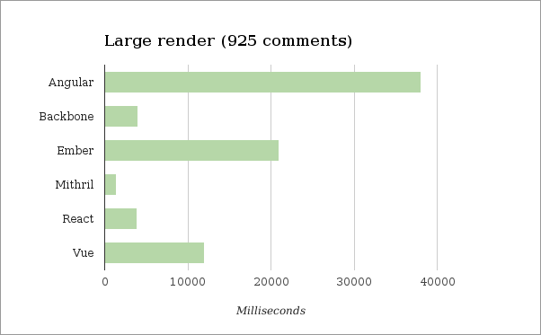
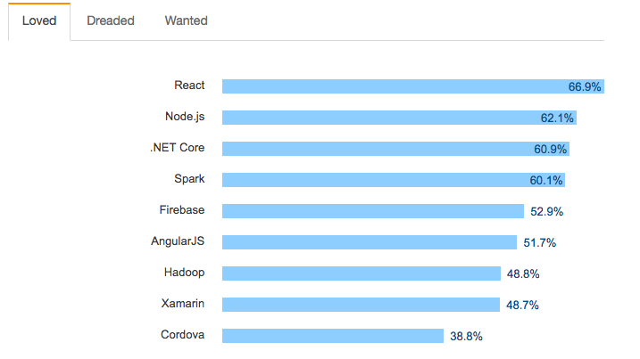
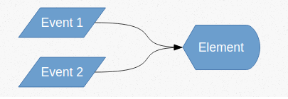
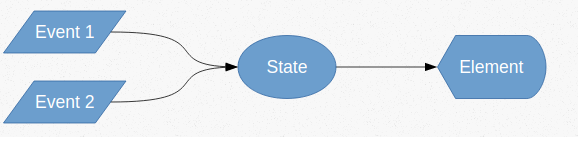
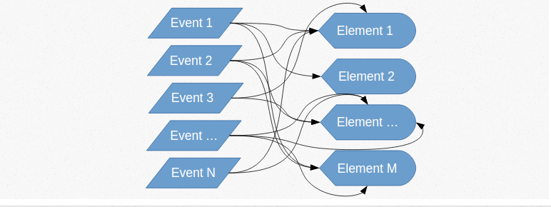
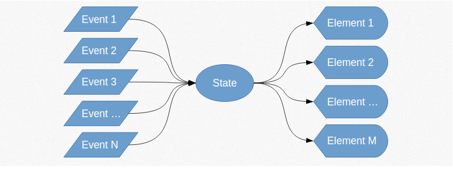
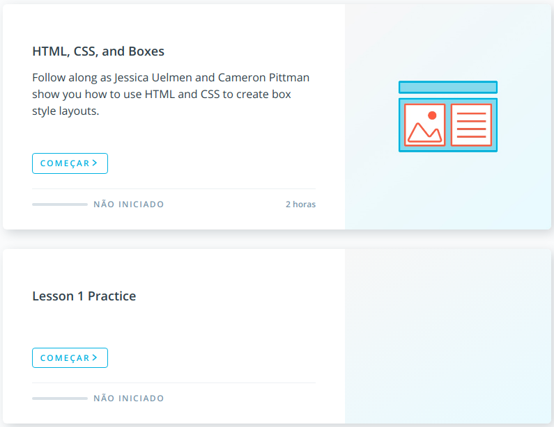

@title[Introduction]
## The React && React Native Presentation
##### <span style="font-family:Helvetica Neue; font-weight:bold">A <span style="color:#e49436">Learning</span> Walking through </span>

---
@title[Rob Info]


<hr />
<span class="smallText">
    <span class="highlight">Software Engineer</span>, 314coin's <span class="highlight">Co-Founder</span>, Teko Porã's <span class="highlight">Producer</span> <br/>
    React/Node, Blockchain/Cryptocurrencies, Music Manager</span>
<hr />
@fa[github] Robsonsjre <br/>
@fa[envelope] robsonsjre@gmail.com <br/>
@fa[linkedin] <a href="www.linkedin.com/in/robsonsjre">
robsonsjre</a> <br/>


---

@title[What is React]
## What is React?
<span style="font-size:0.6em; color:gray">Press Down key for deep dive.</span> |
<span style="font-size:0.6em; color:gray">See [React Wiki](https://reactjs.org/docs/hello-world.html) for details.</span>

@fa[arrow-down]

+++

### It's a JavaScript Library to create interactive interfaces

@fa[arrow-down]

+++
### Created by Facebook on 2013 to solve chat updating problem

---
@title[Advantages]

## Why using it?
<span style="font-size:0.6em; color:gray">Press Down key for deep dive.</span> |

@fa[arrow-down]

+++

- Escalabilidade / Work in team  
  * Componentização / Controle de estado
- Performance |
  * Virtual DOM
- Learn Once, Code all |
  * Web / IOs / Android

+++
### Companies using react/react native
<div>


</div>
<div>


</div>


+++
## Performance


+++
## Developers wanted

</br>
<span style="color:gray; font-size: 0.5em;">the [Stackoverflow Survey 2017](https://insights.stackoverflow.com/survey/2017)</span>


---
## The main Topics to Learn

- State
- JSX
- Components / Props
- Lifecycle
---
@title[State]
# State
## Never modify your interface directly
<span style="font-size:0.6em; color:gray">Press Down key for deep dive.</span> |

+++
### State abstraction between user and element


@fa[arrow-down]

+++
### It gets worse for complex applications



+++
## JQuery usual way
````javascript
<span id="colored-counter">0</span>
<input id="color"></input>
<button id="inc"></button>

<script>
$('#color').on('keyup', function () {
    $('#colored-counter').css('color', this.value);
})

$('#inc').on('click', function () {
    var oldValue = $('#colored-counter').html();
    var newValue = 1 + Number(oldValue);
    $('#colored-counter').html(newValue);
})
</script>
````
@[10-14](Botão lê DOM e escreve DOM diretamente.)

+++
## JQuery React way
````javascript
<span id="colored-counter">0</span>
<input id="color"></input>
<button id="inc"></button>

<script>
var state = {color: '', value: 0};

function updateUI() {
    $('#colored-counter').css('color', state.color);
    $('#colored-counter').html(state.value);
}

$('#color').on('keyup', function () {
    state.color = this.value;
    updateUI();
})

$('#inc').on('click', function () {
    state.value++;
    updateUI();
})
</script>
````
@[6](Objeto para armazenar estado da página)
@[8-11](Função para atualizar interface, no caso do React, ele faz comparação de objetos do estado)
@[18-21](Ao clicar no botão, atualiza estado, e chama função update interface)
---
@title[JSX]
# JSX
### markup language and logic together!
<span style="font-size:0.6em; color:gray">Press Down key for deep dive.</span> |

+++
## JSX Explained
````JavaScript
function SimplePage() {
  const name = 'Rob'
  const sections = [1, 2, 3]
  return (
    <div className="Main">
      <p> This is a P</p>
      <button> Sou um botão</button>
      <p> o nome da variável é {name}</p>
      <p>{10 + 1}</p>
      <h1>{ name === 'Rob' ? 'Rob Personal Info' : 'Other Personal Info' }</h1>
        {
            sections.length > 0
              ? sections.map(n => <div>Section {n}</div>)
              : null
          }
    </div>
  )
}
````

@[6,7](Aceita quase todos elementos de HTML nativo)
@[9,8](Aceita variáveis/expressões no meio do HTML)
@[10](Conditional statments)
@[1,11-15,18](Expression w/ conditional statments)

---

# Components / Props
## Break'into small pieces
<span style="font-size:0.6em; color:gray">Press Down key for deep dive.</span> |

@fa[arrow-down]

+++
### Composing Components
````javascript
function Welcome(props) {
  return <h1>Hello, {props.name}</h1>;
}

function App() {
  return (
    <div>
      <Welcome name="Sara" />
      <Welcome name="Cahal" />
      <Welcome name="Edite" />
    </div>
  );
}

ReactDOM.render(
  <App />,
  document.getElementById('root')
);
````

@[1-3](Component A, data and ux with Props)
@[5-13](Component B)

+++
### Expanding Props

````javascript
function Welcome(props) {
  return <h1>Hello, {props.name || props.email}</h1>;  
}

function App() {
  return (
    <div>
      <Welcome name='' email="Sara@gmail.com" />
      <Welcome name="Cahal" />
      <Welcome name="Edite" />
    </div>
  );
}
````

@[2](Include another props)
@[8](You should pass another props)

+++
### Breaking into small components


+++
````javascript
function Comment(props) {
  return (
    <div className="Comment">
      <div className="UserInfo">
        
        <div className="UserInfo-name">
          {props.author.name}
        </div>
      </div>
      <div className="Comment-text">
        {props.text}
      </div>
      <div className="Comment-status">
        {props.status)}
      </div>
    </div>
  );
}
````

@[4-8](Avatar Component)
@[9-17](Text + Status Component)
+++
## Break Avatar and User Info Component
````javascript
function Avatar(props) {
  return (
    <div className="UserInfo">
      
  );
}

function UserInfo(props) {
  return (
  <div>
      <div className="UserInfo-name">
        {props.author.name}
      </div>
      <div className="Comment-text">
        {props.text}
      </div>
      <div className="Comment-status">
        {props.status)}
      </div>
  </div>
  )
}

````
+++
### Final Component More Simple
````javascript
function Comment(props) {
  return (
    <div className="Comment">
      <Avatar url={props.author.avatarUrl} alt={props.author.name}/>
      <UserInfo name={props.author.name} text={props.text} status={props.status}/>  
    </div>
  );
}
````
+++


---
@title[Lifecycle]

# Lifecycle
## Important component methods
<span style="font-size:0.6em; color:gray">Press Down key for examples.</span> |

@fa[arrow-down]

+++
```JavaScript
class Clock extends React.Component {
  constructor(props) {
    super(props);
    this.state = {date: new Date()};
  }

  componentDidMount() {
    this.timerID = setInterval(
      () => this.tick(),
      1000
    );
  }

  componentWillUnmount() {
    clearInterval(this.timerID);
  }

  tick() {
    this.setState({
      date: new Date()
    });
  }

  render() {
    return (
      <div>
        <h1>Hello, world!</h1>
        <h2>It is {this.state.date.toLocaleTimeString()}.</h2>
      </div>
    );
  }
}
````
@[2-5](Constructor: Recebe props, coloca estado inicial)
@[6-22](Ciclos de vida -> Fetch no banco, listeners)
@[23-31](Renderiza a view)

---

# React native

+++
- Facebook Created special Components for Natives
- Same developoment as react
- Flexbox for Styling
- A lot of libraries with built-in components (Material Design / native elements)
+++
## <div> -> View / <p> -> <Text> /  -> <Image>
````javascript
function Avatar(props) {
  return (
    <View className="UserInfo">
      <Image className="Avatar"
        src={props.author.avatarUrl}
        alt={props.author.name}
      />
      <Text>Titulo da imagem</Text>
      </View>
  );
}

---
@title[Where to Learn]

#### Where to Learn

<br>

- [This presentation](https://gitpitch.com/Robsonsjre/react-presentation/master?grs=github#)
- [Learn React](https://onlinecourses.guru/topic/learn-react-js)
- [React JS / React Native](https://www.facebook.com/groups/reactjs.co)
- [Dan Abramov's Course (REACT / REDUX / REACTNATIVE)](https://egghead.io/courses/start-learning-react)


---
@title[Get The Word Out!]

## GO FOR IT.
## Dúvidas?
